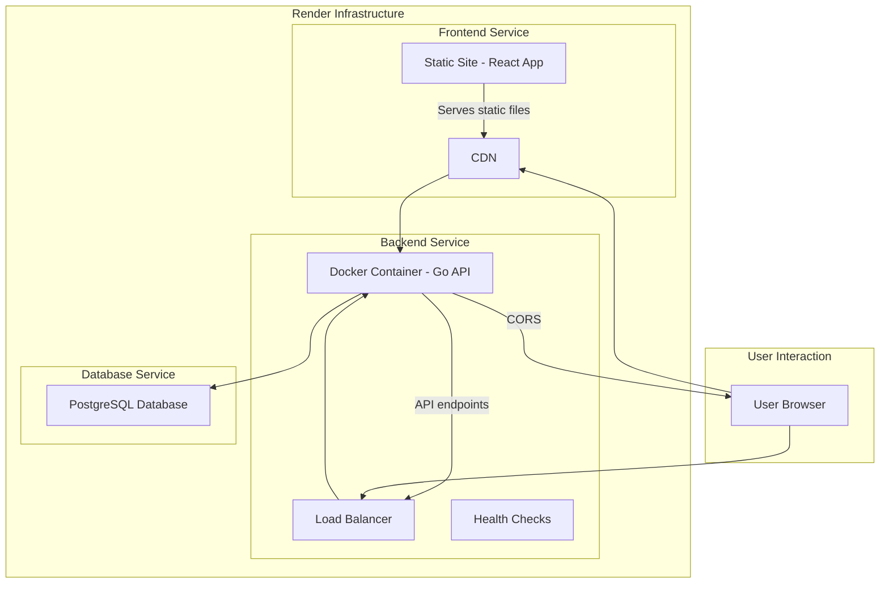

# System Architecture

## Current Deployment Architecture

## Component Descriptions

### Frontend Service
- **Type**: Render Static Site
- **Technology**: React.js with Create React App
- **Hosting**: Served directly from Render's CDN
- **Build Process**: `npm run build` creates optimized static files
- **Routing**: Client-side routing with history fallback

### Backend Service
- **Type**: Render Web Service with Docker
- **Technology**: Go with Fiber framework
- **Hosting**: Docker container running on Render infrastructure
- **API**: RESTful endpoints for all application functionality
- **Security**: JWT authentication, CORS protection, URL validation, WAF rules

### Database Service
- **Type**: Render PostgreSQL
- **Technology**: PostgreSQL 15
- **Features**: Automatic backups, monitoring, scaling options

## Data Flow

1. **User Access**: User visits the frontend URL
2. **Frontend Delivery**: Static files served from CDN
3. **API Requests**: Frontend makes API calls to backend service
4. **Backend Processing**: Backend processes requests and interacts with database
5. **Response**: Backend returns data to frontend
6. **UI Update**: Frontend updates the user interface with received data

## Benefits of This Architecture

1. **Scalability**: Frontend and backend can be scaled independently
2. **Performance**: Static files served from CDN for faster loading
3. **Maintainability**: Clear separation of concerns
4. **Cost-Effectiveness**: Optimized resource usage for each service
5. **Reliability**: Isolated failure points
6. **Flexibility**: Can easily swap components or add new services