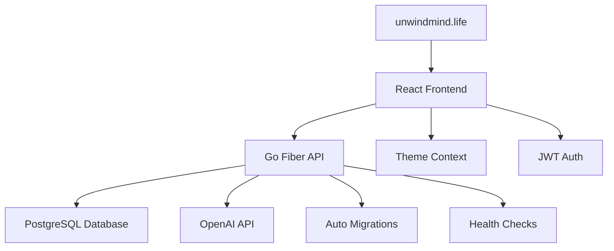

# Mental-Health-App

# 🌿 UnwindMind - Mental Health App

A comprehensive full-stack mental health platform with AI support, mood tracking, journaling, and therapy booking.

## 🌐 Live Demo

**🔗 Visit: [unwindmind.life](https://unwindmind.life)**

## ✨ Features

### Core Features
- 🔐 **Secure Authentication** - JWT-based user login/registration
- 📊 **Mood Tracking** - Daily mood logging with notes
- 📝 **Personal Journaling** - Private journal entries with CRUD operations
- 🤖 **AI Chat Assistant** - OpenAI-powered mental health support
- 🎨 **Theme Switching** - Beautiful black/white theme toggle
- 💳 **Billing System** - Subscription plans and payment management
- 🩺 **Therapy Booking** - Schedule sessions with licensed therapists

### Technical Features
- 📱 **Responsive Design** - Works on all devices
- 🔄 **Real-time Updates** - Live data synchronization
- 🛡️ **Security** - CORS, input validation, SQL injection protection
- 🚀 **Performance** - Optimized builds and caching
- 💾 **Database** - PostgreSQL with automatic migrations

## 🏠 Architecture



## 📁 Project Structure

```
Mental-Health-App/
├── cli/                    # CLI application (separate from web deployment)
│   ├── main.go            # CLI entry point
│   ├── internal/          # CLI internal packages
│   └── README.md          # CLI documentation
├── frontend/              # React frontend application
│   ├── src/
│   └── public/
├── mentalhealthwebapp/    # Go backend web service
│   ├── main.go           # Web server entry point
│   ├── routes/
│   └── config/
└── terraform/            # Infrastructure as code
```

## 🛠️ Tech Stack

### Frontend
- ⚛️ **React 18** - Modern UI library
- 🎨 **Tailwind CSS** - Utility-first styling
- 🗺️ **React Router** - Client-side routing
- 🌍 **Axios** - HTTP client with interceptors
- 🎨 **Context API** - Global theme management

### Backend
- 🔥 **Go Fiber** - Fast HTTP framework
- 🔑 **JWT Authentication** - Secure sessions
- 💾 **PostgreSQL** - Reliable database
- 🤖 **OpenAI API** - AI chat integration
- 🛡️ **bcrypt** - Password hashing

### Deployment
- ☁️ **Render** - Cloud hosting platform
- 🌍 **Custom Domain** - unwindmind.life
- 🚀 **CI/CD** - Automatic deployments
- 📊 **Health Monitoring** - Built-in checks

## 🚀 Quick Start

### Prerequisites
- Go 1.24+
- Node.js 18+
- PostgreSQL 15+
- OpenAI API Key

### Local Development

```bash
# Clone repository
git clone https://github.com/leketech/mental-health-app.git
cd mental-health-app

# Start with Docker (Recommended)
docker-compose up -d

# OR Manual Setup
# Backend
cd mentalhealthwebapp
cp .env.example .env  # Configure your environment
go mod tidy
go run main.go

# Frontend
cd ../frontend
npm install
npm start

# CLI Application (Optional)
cd ../cli
go run main.go
```

## 🌐 Deployment

See [DEPLOYMENT.md](./DEPLOYMENT.md) for detailed deployment instructions.

### Deploy to Render
1. Push to GitHub
2. Connect to Render
3. Configure domain DNS
4. Set OpenAI API key
5. Deploy automatically!

## 📊 API Endpoints

### Public
- `GET /health` - Health check
- `POST /api/login` - User login
- `POST /api/register` - User registration
- `POST /api/chat` - AI chat (no auth required)

### Protected (Requires JWT)
- `GET /api/moods` - Get user moods
- `POST /api/moods` - Create mood entry
- `GET /api/journals` - Get user journals
- `POST /api/journals` - Create journal entry
- `PUT /api/journals/:id` - Update journal
- `DELETE /api/journals/:id` - Delete journal
- `POST /api/logout` - User logout

## 📱 Screenshots

*Coming soon - Beautiful screenshots of the app in action!*

## 🔒 Security

- 🔐 JWT token authentication
- 🛡️ SQL injection protection
- 🌐 CORS configuration
- 🔒 Password hashing with bcrypt
- 🙅 Input validation and sanitization
- 📊 Rate limiting (planned)

## 🤝 Contributing

This is a proprietary project. Please contact the author for collaboration opportunities.

Copyright (c) 2025 Aduraleke Faith Akintade

All rights reserved.

This source code is proprietary and confidential. No part of this code may be copied, modified, distributed, or used without explicit written permission from the author.

Unauthorized use is strictly prohibited and may result in legal action.
